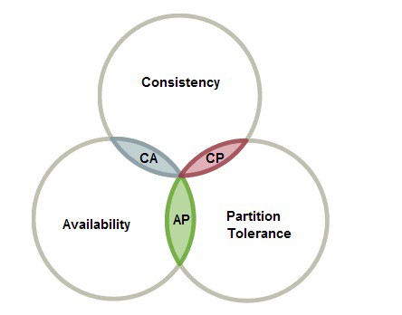
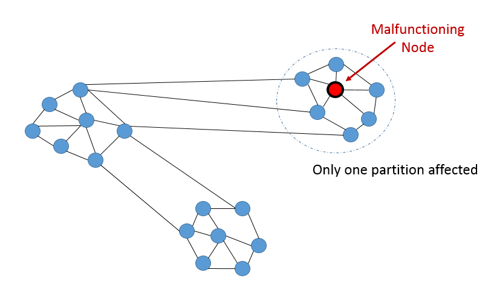
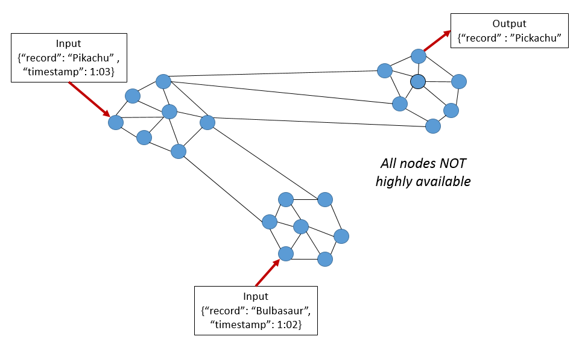

# CAP Theorem 

* A distributed database system can only have 2 of 3: Consistency, Availability, Partition Tolerance

## Partition Tolerance

* This condition states that the system continues to run, despite the number of message being delayed by the network between the nodes. 
* A Partition-Tolerant system can handle any amount of **network failure** that doesn't result in a failure of entire network. 
* ata records are sufficiently replicated across combinations of nodes and networks to keep the system up through intermittent outages. When dealing with modern distributed systems, Partition Tolerance is not an option. It’s a necessity. **Hence, we have to trade between Consistency and Availability.**

## High Consistency 

* **Condition**: All nodes see the same data at the same time. 
* Eg Performing a read operation will return the value of the most recent write operation causing all nodes to return the same data. 
* A system has consistency if a transaction starts with the system in a consistent state, and ends with the system in a consistent state.
* A **system can and does shift into inconsistent state during the transaction** 

## High Availability 

* **Condition**: Every request gets a response on success/failure. 
* System remains operational 100% of time. 
* Every client gets response regardless of state of any individual node in ths system. 