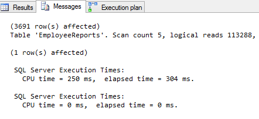
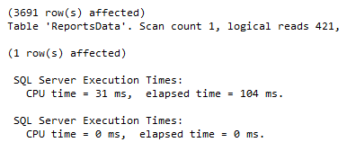
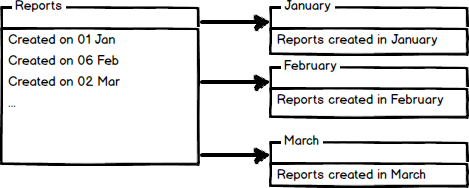

# Partitioning
* **DEIFICATION**: It is process by which a very large table is broken down into smaller tables. This can result in **faster queries** as they will have less data to scan. 
* This also **aids in maintenance of larger table** and reduce overall response time to read and load data. 

## Vertical Partitioning 
* This **increases performance** in queries which return all columns from a table that contains **a number of very wide TEXT or BLOB columns** 
* This can also be used to **restrict access to specific data such as passwords** 
* It splits table into **two or more tables** containing **different columns**
### Example of Vertical Partitioning 
* Large table of reports for employee containing 
    * Report_Name
    * Report_ID 
    * Number of Report 
    ...
    * Large columns with report description. 

* Assume **95%** search on report name and number, etc and **5%** search on report description. Now let' say each of the search will run the **clustered index scans** which reads all rows of table. Hence **performance of clustered index scan is proportional to number of rows** 
* `GOAL`: MINIMIZE IO Operation and reduce cost of each search. 

```
CREATE TABLE EmployeeReports (
    Report_ID INT IDENTITY(1,1) NOT NULL, 
    Report_Name VARCHAR(100) NOT NULL,
    Report_Number VARCHAR(20) NOT NULL, 
    Report_Description VARCHAR(MAX) NOT NULL, 
    CONSTRAINT EReport_PK PRIMARY KEY CLUSTERED (Report_ID)
)

DECLARE @i INT
SET @i = 1

BEGIN TRAN
WHILE i < 100000
BEGIN 
INERT INTO 
    EmployeeReports(
        Report_Name, 
        Report_Number, 
        Report_Description
    ) Values (
        'Report Name', 
        CONVERT(VARCHAR(20)m @i),
        REPLICATE('REPORT', 1000)
    )
SET @i = @i + 1
END
COMMIT TRAN
GO 
```
* **RUNNING AND CHECKING STATS** 
```
SET STATISTICS IO ON
SET STATISTICS TIME ON
SELECT 
    er.ReportID,
    er.ReportName, 
    er.ReportNumber
FROM 
    dbo.EmployeeReports er
WHERE 
    er.ReportNumber LIKE '%33%'
SET STATISTICS IO OFF
SET STATISTICS TIME OFF
```


* TO **REDUCE COST OF QUERYING** We will vertically partition the table

```
CREATE TABLE Report_Description(
    Report_ID INT FOREIGN KEY REFERENCES Employee_Reports (Report_ID), 
    Report_Description VARCHAR(MAX)
    CONSTRAINT PK_ReportDescription PRIMARY KEY CLUSTERED (Report_ID)
)

CREATE TABLE Report_Date (
    Report_ID INT NOT NULL, 
    Report_Name VARCHAR(100) NOT NULL, 
    Report_Number VARCHAR(20) NOT NULL 
    CONSTRAINT ReportData_PK PRIMARY KEY CLUSTERED (Report_ID)
)

INSERT INTO 
    dbo.ReportData (
        Report_ID, 
        Report_Name, 
        Report_Number
    )
SELECT 
    er.Report_ID, 
    er.Report_Name, 
    er.Report_Number
FROM 
    dbo.EmployeeReports er 
```

* Same query as previous will give better results

```
SET STATISTICS IO ON
SET STATISTICS TIME ON
SELECT 
    er.ReportID, 
    er.ReportName, 
    er.ReportNumber
FROM 
    ReportsData er
WHERE 
    er.ReportNumber LIKE '%33%'
SET STATISTICS IO OFF
SET STATISTICS TIME OFF
```



> **NOTE**: Vertical partitioning on SQL Server tables may not be the right method in every case. However, if you have, for example, a table with a lot of data that is not accessed equally, tables with data you want to restrict access to, or scans that return a lot of data, vertical partitioning can help.

## Horizontal Partitioning 
* It **divides the tables with same number of columns but lesser number of rows** 
* **EXAMPLE**: If a table has large number of reports based on month, then the table can be horizontally partitioned into tables **by year**. 
> **NOTE** The partitioning should be done in a way that quires reference as lesser tables as possible. 

