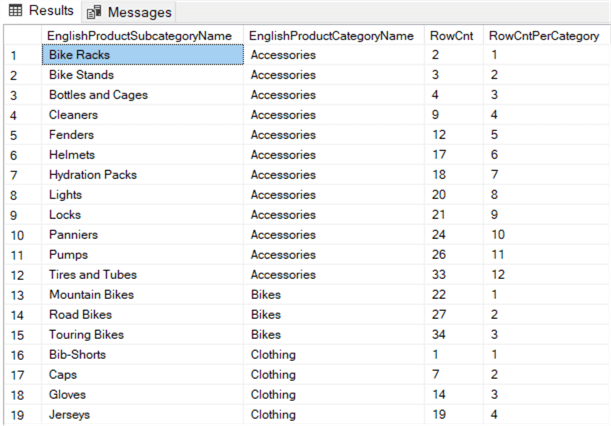

# Rank

## ROW_NUMBER
* It is a windows function(calculation across set of rows)
* **SYNTAX**
    > `ROW_NUMBER() OVER (PARTITION BY expression ORDER BY expression)`
    * ROW_NUMBER followed by parenthesis and OVER and ORDER BY is mandatory where as PARTITION BY is optional. 
    * When PARTITION BY is specified it divides the result returned by FROM clause into partitions on which ROW_NUMBER is applied. 
* This function add **virtual sequence number** to rows. It adds unique incrementing number to the result grid which is determined by **order by** expression. 
* Using a Partition BY clause makes this incrementing number reset once it crosses the partition. 
* Depending on **PARTITION BY** this sequence can be **restarted multiple times** 
> **NOTE** There is no guarantee that row number returned by sql will be same for every execution. 
* ROW_NUMBER and RANK are similar, both start at 1 but RANK can repeat in CASE of ties. 

### **Example 1**
```
SELECT 
    sc.[EnglishProductSubCategoryName],
    [c].[EnglishProductCategoryName],
    [RwCnt] = ROW_NUMBER() OVER (ORDER BY [sc].[EnglishProductSubCategoryName]),
    [RwCntPerCategory] = ROW_NUMBER() 
        OVER 
            (PARTITION BY c[EnglishProductCategoryName]
             OREDER BY sc.[EnglishProductSubCategoryName])
FROM
    [dbo].[DimProductSubCategory] sc
JOIN 
    [dbo].[DimProductCategory] c
ON
    [c].[ProductCategoryKey] = [sc].[ProductCategoryKey]
ORDER BY 2, 1;
```

* The above query calculates a general row_number and a row_number which is reset every category. 


### Example 2: Removing Duplicates Using Row_Number
* When you have true duplicates where all column values are exactly same they can be easily deleted using `DISTINCT or GROUP BY`
* ROW_NUMBER can be used to remove duplicates in business sense. 
```
WITH cte_source AS (
    SELECT 
        Id, 
        EmployeeKey, 
        EmployeeName, 
        InsertDate, 
        RowId = ROW_NUMBER() 
            OVER 
                (PARTITION BY EmployeeKey ORDER BY InsertDate)
    FROM
        [dbo].[Employees]
)
DELETE FROM cte_source WHERE RowId > 1

```